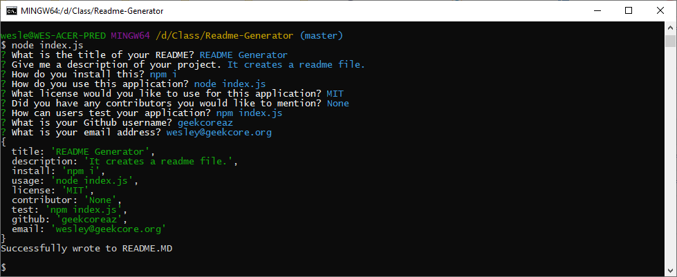

# README-Generator



---
## Description
A command-line application that takes input from the user and creates a README.md file.

---

## How To Use
To use this application, clone or download the repo to your computer, run a NPM install in your terminal, and then run "node index.js" in the terminal.

```
npm i

node index.js
```

---
Wesley Stroeber  
<wesley@geekcore.org>